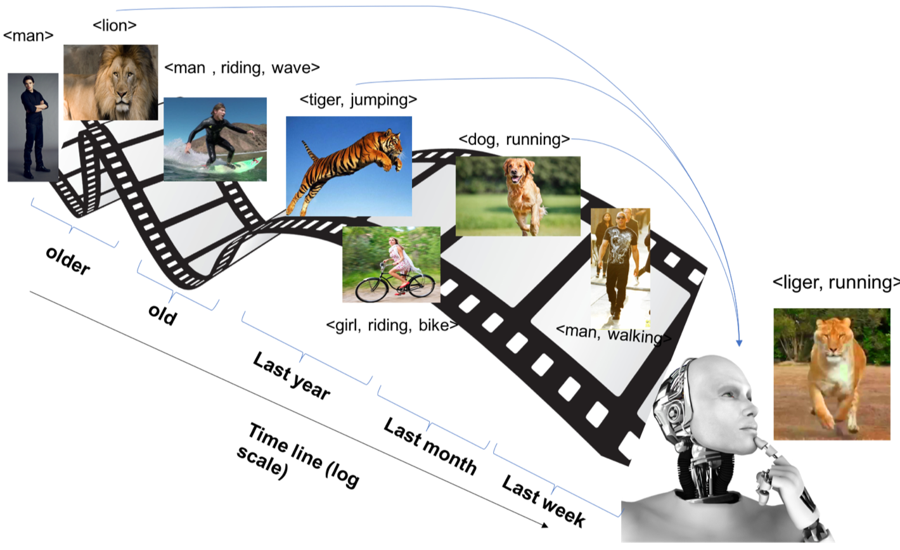

title: "Lifelong Fact Learning"

This a pytorch implementation of [Exploring the Challenges towards Lifelong Fact Learning](https://arxiv.org/pdf/1812.10524.pdf)

## Results on Mid-scale dataset (random split)
| Method                         |  T1      | T2       | T3       | T4        | Mean      |
| :---                           |  :----:  |  :----:  |  :----:  |  :----:   |  :----:   |
| Finetune                       |  72.77%  | 40.31%   | 33.87%   | 84.02%    | 57.74%    |
| MAS                            |  78.82%  | 51.06%   | 48.17%   | 86.71%    | 66.19%    |

## Results on Mid-scale dataset (semantic split)
| Method                         |  T1      | T2       | T3       | T4        | Mean      |
| :---                           |  :----:  |  :----:  |  :----:  |  :----:   |  :----:   |
| Finetune                       |  16.24%  | 35.63%   | 31.97%   | 8.86%     | 23.18%    |
| MAS                            |  16.25%  | 35.63%   | 33.64%   | 15.51%    | 25.26%    |

## Average Precision Analysis on mid-scale dataset (random split)
| Method                         |  LCH      | WUP       | RES       | JCN       |  LIN      | PATH      | W2V_GN     |
| :---                           |  :----:  |  :----:  |  :----:  |  :----:   |  :----:   |  :----:   |  :----:   |
| Finetune                       |  18.78%  | 18.69%   | 18.34%  | 23.43%     | 19.47%    | 18.78%     | 20.99%     |
| MAS                            |  21.52%  | 22.41%   | 18.89%   | 17.28%    | 18.59%    | 21.52%	|   23.70%  |

## Results on Large-scale dataset (random split)
| Method                         |  T1      | T2       | T3       | T4       |  T5      | T6       | T7       | T8       | Mean     |
| :---                           |  :----:  |  :----:  |  :----:  |  :----:  |  :----:  |  :----:  |  :----:  |  :----:  |  :----:  |
| Finetune                       |  14.01%  | 23.83%   | 21.67%   | 17.43%   | 26.13%   | 17.99%   | 15.67%   | 43.44%   | 22.52%   |
| MAS                            |  19.80%   | 30.37%  | 27.73%   | 24.62%   | 33.87%   | 25.36%   | 24.73%   | 43.65%   | 28.77%   |

## Results on Large-scale dataset (semantic split)
| Method                         |  T1      | T2       | T3       | T4       |  T5      | T6       | T7       | T8       | Mean     |
| :---                           |  :----:  |  :----:  |  :----:  |  :----:  |  :----:  |  :----:  |  :----:  |  :----:  |  :----:  |
| Finetune                       |          |          |          |          |          |          |          |          |          |
| MAS                            |          |          |          |          |          |          |          |          |          |

## Average Precision Analysis on mid-scale dataset (random split)
| Method                         |  LCH      | WUP       | RES       | JCN       |  LIN      | PATH      | W2V_GN     |
| :---                           |  :----:  |  :----:  |  :----:  |  :----:   |  :----:   |  :----:   |  :----:   |
| Finetune                       |  22.12%  | 21.62%   | 19.46%  | 20.77%     | 17.98%    | 22.12%     | 18.74%    |
| MAS                            |  16.82%  | 18.14%   | 20.18%  | 17.91%     | 18.97%    | 16.82%	|   18.89%  |

## Requirements:

To make things easier we provided the environment file `environment.yml` created by running the command `conda env export -f environment.yml`.
To clone the environmentt you can simply run `conda env create -f environment.yml` from the project root directory.

## Data
### Mid-scale
Download the mid-scale dataset (6DS) along with the annotations from [here](https://www.dropbox.com/sh/dl0tzjo922um6jv/AACAOO0aFcNy0HI1r9ON303ja/LLL_files?dl=0&preview=mid_scale.zip&subfolder_nav_tracking=1)
and unzip the mid-scale.zip folder under `data/`.

### Large-scale
Download the large-scale dataset (Sherlock LSC) along with the annotations from [here](https://www.dropbox.com/sh/dl0tzjo922um6jv/AACAOO0aFcNy0HI1r9ON303ja/LLL_files?dl=0&preview=large_scale.zip&subfolder_nav_tracking=1)
and unzip the large-scale.zip folder under `data/`.

## Training:

To train one of the experiments in the paper follow the following steps:
1. `cd code/experiments`
2. run one of the scripts in the experiments folder as the below example:
 
`python run_mas_8tasks.py --split random --reg_lambda 5 --base_lr 0.00005 --batch_size 70 --epochs 301 --trainval`

`split` the data split to train on. The options are: random and semantic

`reg_lambda` the regulizer lambda to use

`base_lr` the base learning rate

`batch_size` the batch size

`epochs` the number of epochs for each task

`trainval` whether to use the validation sets along with the training sets of previous tasks as regularization sets

After training is done the CV_features are automatically extracted and saved in CV_feat, which is later used 
for evaluation.

## Evaluation:
### Mid-scale
To evaluate the trained models on mid-scale data run on of the following files:
* `extract_results_mds_random.py` for evaluating all the mid-scale models on random split within `CV_feat` using standard evaluation.
* `extract_results_mds_semantic.py` for evaluating all the mid-scale models on semantic split within `CV_feat` using standard evaluation.
* `extract_results_mds_random_generalized.py` for evaluating all the mid-scale models on random split within `CV_feat` using generalized evaluation.
* `extract_results_mds_semantic_generalized.py` for evaluating all the mid-scale models on semantic split within `CV_feat` using generalized evaluation.
* `ap_analysis_mds_random.py` for evaluating all the mid-scale models on random split within `CV_feat` using the new metric inspired from [cite ltvrr].
* `ap_analysis_mds_semantic.py` for evaluating all the mid-scale models on semantic split within `CV_feat` using the new metric inspired from [cite ltvrr].

### Large-scale
To evaluate the trained models on large-scale data run on of the following files:

* `extract_results_lrs_random.py` for evaluating all the large-scale models on random split within `CV_feat` using standard evaluation.
* `extract_results_lrs_semantic.py` for evaluating all the large-scale models on semantic within `CV_feat` using standard evaluation.
* `extract_results_lrs_random_generalized.py` for evaluating all the large-scale models on random split within `CV_feat` using generalized evaluation.
* `extract_results_lrs_semantic_generalized.py` for evaluating all the large-scale models on semantic within `CV_feat` using generalized evaluation.
* `ap_analysis_lrs_random.py` for evaluating all the large-scale models on random split within `CV_feat` using the new metric inspired from [cite ltvrr].
* `ap_analysis_lrs_semantic.py` for evaluating all the large-scale models on semantic within `CV_feat` using the new metric inspired from [cite ltvrr].

## Running Evaluation on Pre-trained Models:

To run evaluation on our pre-trained models from Table 1: 
* Download the checkpoints folder from [here]() and unzip the checkpoints.zip folder in the project root directory.
* Download the output visual embeddings from [here]() and unzip the CV_feat.zip folder under the root/outputs/ folder.

Then simply run the desired evaluation script from the ones above to evaluate the downloaded models.

## Directory Structure
The final project structure should look like this:
```
.
├── checkpoints
│   ├── large_scale
│   │   └── ...
│   └── mid_scale
│       └── ...
├── code
│   ├── experiments
│   │   └── ...
│   ├── models
│   │   └── ...
│   └── utils
│       └── ...
├── data
│   ├── large_scale
│   │   ├── images
│   │   │   ├── test
│   │   │   └── train
│   │   ├── info
│   │   ├── NLP_feat 
│   │   └── splits
│   └── mid_scale
│       ├── images
│       │   ├── test
│       │   └── train
│       ├── info
│       ├── NLP_feat
│       └── splits
├── eval
│   ├── APcode
│   ├── eval_files
│   └── ...
└── outputs
    └── CV_feat
```
